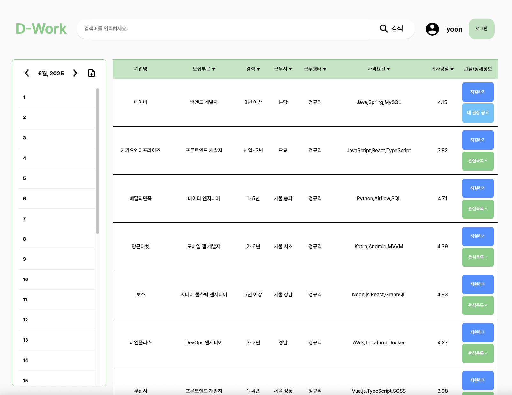

# 잡초농가 팀 D-WORK 프로젝트

- Preview

채용 공고 플랫폼을 Vanila JS, AWS를 이용해서 개발한 프로젝트입니다.

## 🖥️ 핵심 기능

| 구분              | 기능 설명                                      | 관련 함수 및 설명                                                    |
| -------------- | ------------------------------------------ | --------------------------------------------------------- |
| 🔍 공고 검색   | 입력 후 버튼 클릭 또는 Enter 키로 공고 검색              | `findKeyWord`, `dataProcessing` |
| 📰 공고 렌더링   | 공고 데이터를 화면에 정해진 규격에 맞춰 렌더링              | `postRender`, `postListTemplate` |
| 🎯 검색 필터링   | 검색 데이터를 선택한 기준에 맞게 필터링           | `handleCheckboxFilter`, `applyFilterByCareer`, `initCareerFilter` |
| ↕️ 공고 정렬   | 기업명과 회사평점을 오름차순, 내림차순으로 정렬        | `toUpSortArray`, `toDownSortArray` |
| ⭐ 관심 공고 추가/제거   | 사용자가 관심있는 공고를 북마크에 저장,삭제,관리      | `getMyBookmarks`, `addBookmark`, `deleteBookmark` |
| 📅 캘린더   | 사용자가 북마크애 저장한 공고의 마감일을 캘린더에 표시      | `renderCalendar`, `getUserBookmarkList`, `getCompanies` `createDay` |
| 📝 노트 페이지   | 노션 스타일의 노트, 텍스트 입력, 삭제     | `renderNote`, `handleEnter`, `handleBackspace`, `focusEnd` |
| 💾 노트 데이터 관리   | 노트 데이터를 자동 저장 및 불러오기     | `noteLoadHandler`, `noteSectionLoad`, `noteSectionSaveCallback` |
| 📂 노트 디렉토리   | 노트 디렉토리 구조 제작 및 렌더링    | `renderTree`, `initDocTree` |
| 🌐 클라이언트 API   | 클라이언트 API 요청 라이브러리    | `getDoc`, `getMyBookmarks`, `loginExecute`, `reqSignIn`, `getPosting` |

 

---

# 🛠️ 사용 기술 스택

| 분류    | 기술                                                 |
| ----- | -------------------------------------------------- |
| 언어    | `HTML`, `CSS`, `JavaScript`                        |
| 저장 방식 | `sessionStorage`, `AWS`, `Programmers API`                        |
| 환경    | `Vanilla JS` 기반 모듈화 (`import/export`) |
| 스타일   | CSS 모듈 방식, 애니메이션 및 상태 변화 클래스 적용                    |
| 브랜치 전략   | `Github Flow`                    |
| 기타    | `VS Code`, `Prettier` 코드 포맷 설정                     |

 

---

## 🧩 문제 정의

---

- 채용 공고 보거나 검색했을 때 정렬 방식이 한정됨
  - 채용 공고를 볼 때 정렬 방식이 큰 사진 + 기업명 + 정보라 목록 상에서 간단한 정보를 한눈에 보기 어려움
- 검색 기록 삭제 불가(잡플래닛 한정)
  - 잘못 검색 했을 시에도 검색 기록이 남고 지워지지 않아 다음에 검색할 때 불편
- 채용 공고에서 회사 정보 확인 불가
  - 채용 공고에 회사명 클릭하여도 채용 공고 페이지로 전환됨
- 기업 정보를 확인하려면 상세페이지에서 기업정보 페이지로 이동하는 등 불필요한 단계 존재
- 공고 상세 페이지의 화면 활용도가 떨어짐, 사이드에 빈 여백이 존재
- 검색 기능 강화(카테고리 세분화, 기술스택 일원화 등 필터링 요소 세분화)
- 리뷰칸의 고정 형식이 존재→자유롭게 선택 가능한 리뷰
- 공고 상세페이지의 형식화
- 기업의 요구조건 검색 및 분류
- 서류,면접 등의 합격 여부 알림

## 💁‍♂️ 목표 사용자

---

- 누가 사용할 것인가?
  - 취준생
  - 이직 희망자
  - 채용 희망 기업

## 💡유사 서비스 분석

---

- 비슷한 서비스가 있다면?
  - 잡플래닛
  https://www.jobplanet.co.kr/job
  - 잡다
  https://www.jobda.im/jobs

## ✨ 차별점

---

- 공고 리스트에서 최대한 많은 정보 수집 가능
- 다양한 카테고리와 세분화된 필터링으로 검색 기능 강화(기술스택 등)
- 자유로운 리뷰 문화
- 캘린더에 선호하는 기업 또는 찜한 공고 추가

 
---
 

# 프로젝트 팀 구성 및 역할

## 윤대웅(팀장)
- 프로젝트 진행 관리
- HTML 스켈레톤 구현
- AWS 백엔드 구현
- 노션 글 렌더링 및 저장 구현
- 클라이언트 API 요청 라이브러리 구현
## 김윤지
- 디자인
- 캘린더 css
- 캘린더 렌더링 구현
- 캘린더 모달 구현
- 노트 페이지 이동
- 마크다운 구현
## 정소영
- 공고목록 렌더링
- 관심공고 추가제거
- 오름차순/내림차순 정렬
## 성창식
- 필터 css
- 필터 렌더링 구현
- 필터 상태 관리 구현
# 손영웅
- 검색 기능 구현
- 메모 디렉토리 바 구현(디렉토리 구조 렌더링 및 파일 생성 삭제에 따른 서버 ↔ 로컬 데이터 업데이트)
---

 